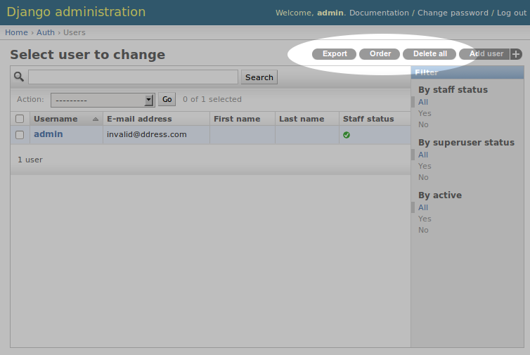
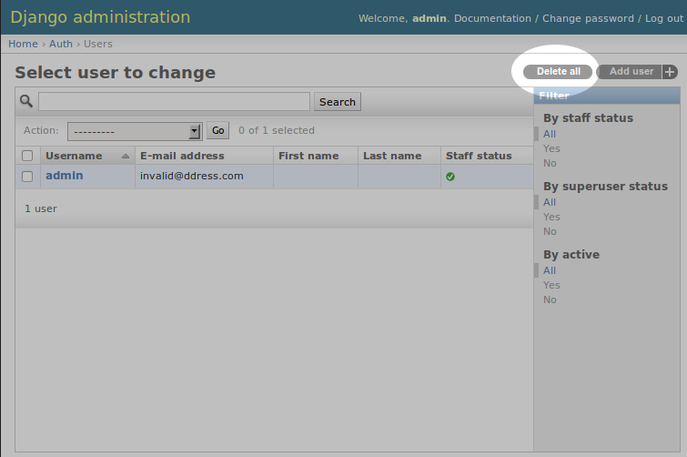

Django Object Tools
===================
**Django app enabling painless creation of additional admin object tools.**

.. image:: https://travis-ci.org/praekelt/django-object-tools.svg
    :target: https://travis-ci.org/praekelt/django-object-tools

.. image:: https://coveralls.io/repos/github/praekelt/django-object-tools/badge.svg?branch=develop
    :target: https://coveralls.io/github/praekelt/django-object-tools?branch=develop

.. image:: https://badge.fury.io/py/django-object-tools.svg
    :target: https://badge.fury.io/py/django-object-tools

.. contents:: Contents
    :depth: 5

Requirements
------------

#. Python 2.7, 3.5-3.7

#. Django 1.11, 2.0, 2.1

Installation
------------
#. Install or add ``django-object-tools`` to your python path.

#. Add ``object_tools`` to your ``INSTALLED_APPS`` setting. ``django-object-tools`` overrides certain admin templates so you have to add it **before** ``django.contrib.admin``.

#. Hook up URLConf. Do this by pointing a given URL at the ``tools.urls`` method. In this example, we register the default ``Tools`` instance ``object_tools.tools`` at the URL ``/object-tools/``:

   .. code-block:: python

    # urls.py
    from django.conf.urls.defaults import *
    from  django.conf.urls import url
    import object_tools

    urlpatterns = [
        path('object-tools/', object_tools.tools.urls)
    ]

#. Obviously Django Admin itself needs to be installed, as described `here <https://docs.djangoproject.com/en/dev/ref/contrib/admin/>`_.

#. Remember to run ``migrate`` whenever you install new tools to setup permissions.

Usage
-----

``django-object-tools`` itself doesn't do much in terms of providing useful tools. Its purpose is to simplify creation and integration of custom tools delivered by other Django applications. To that end it takes care of the messy details like permissions and admin template integration so you can focus on the fun stuff.

As an example lets create a tool allowing you to delete all objects. Yes this is a bit convoluted but it's a good toy example for illustration purposes. Have a look at `django-export <http://pypi.python.org/pypi/django-export>`_ and `django-order <http://pypi.python.org/pypi/django-order>`_ for examples of real world tools leveraging ``django-object-tools``.

Firstly create a Django app folder structure as per usual, with the root directory named ``delete``, including a file called ``tools.py``. It should look as follows::

    delete/
        __init__.py
        tools.py

Edit ``tools.py`` to look like this:

.. code-block:: python

    from django.contrib.admin.actions import delete_selected
    from django.contrib.admin.sites import site
    import object_tools

    class Delete(object_tools.ObjectTool):
        name = 'delete'
        label = 'Delete all'

        def view(self, request, extra_context=None):
            queryset = self.model.objects.all()
            modeladmin = site._registry.get(self.model)
            response = delete_selected(modeladmin, request, queryset)
            if response:
                return response
            else:
                return modeladmin.changelist_view(request)

    object_tools.tools.register(Delete)

Let's go through that line by line:

1. ``object_tools`` behaves similarly to Django's admin allowing you to explicitly register tools, see line 17. It also provides the ``ObjectTool`` base class.

3. import ``delete_selected`` method provided by Django. This method will do all the heavy lifting.

5. Create a tool class inheriting from ``object_tools.ObjectTool``. All object tools have to inherit from ``object_tools.ObjectTool``. ``ObjectTool`` provides various methods to simplify creation of tools. See `object_tools.options.py <https://github.com/praekelt/django-object-tools/blob/master/object_tools/options.py>`_ for more details.

6. Set tool name to ``delete``. This has to be a unique name identifying the tool. This is used to uniquely identify the tool internally and for instance to setup permissions.

7. Set label to ``Delete all``. The label is displayed within admin and not the name, thus allowing you to specify a more verbose, user friendly label.

9. Implement ``view`` method. This is the brains of your tool. The ``view`` method is called when the user executes your tool, so your tool logic would go here. This can be any view like code, as long as it returns an ``HttpResponse`` object. In this case we wrap Django's built-in ``delete_selected`` to provide the form, logic and template code to perform the actual delete.

17. Register the tool with ``object_tools``, thus enabling its display in admin.

To enable the tool add ``delete`` to your ``INSTALLED_APPS`` setting.

Now when you navigate to the change list view of any model you'll find the *delete all* object tool in the upper right hand corner.

Clicking on the *Delete all* tool fires off the view and proceeds with deleting objects as per usual.

**Note:** ``django-object-tools`` adds per tool permissions to the built-in set of default Django permissions. So in this example only superusers or users who have the the *Can delete <model>* permission will be able to see and use the tool. If you can't see or use a particular tool make sure the authenticated user has the required permissions to do so.
